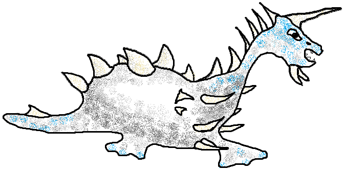
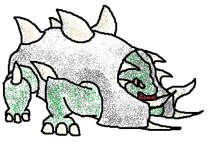
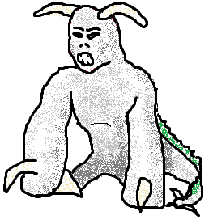
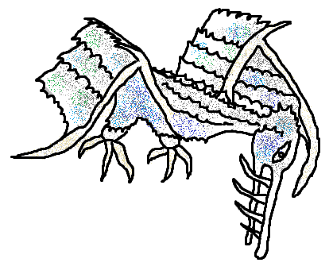
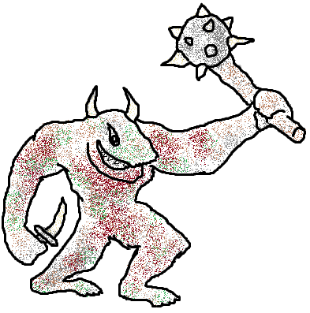
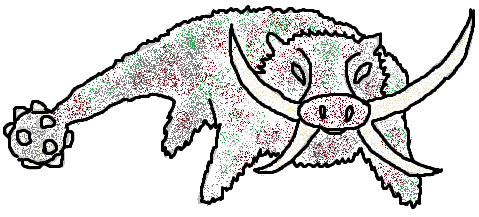

# Enemy Cards

Now with epic paint skills concept art! 😎

## Enemy Types

### Demons

The main causes of all evils in this world.

### Corrupted-

Each playable species is corruptible by demons, and with all the demons around, 
each species will have members that have already been corrupted.

When encountering a corrupted spirit, it will seek out its kin. For instance, 
if you encounter a corrupted elf, it will try to corrupt the elf on your team, 
if you have any. A corrupted goblin will try to convert the goblin and murder 
the others, etc.

@todo

### Infected-

Each playable species is prone to infection by viruses.

@todo

### Torturan

Goatish turtle-like river-dwelling herbivore with plenty of spikes.

Non-aggressive, slow, sneaky, tough defence, stabs when approached.

Often found in rivers and deltas, torturans prefer to be left alone and eat all 
plants in and around the river. If you get close, or between them and their 
precious plants, you can certainly expect a stab from their frontal horn, or 
get slapped by their spiked tail.

Their skin is, for the most part, hardened into an almost metallic protective 
layer. They are hard to kill, but they do have weak spots, such as their necks 
and finns. 

Tough as they are, they often get attacked by predators who hunt them for their 
metal skins 

Variants:
- Young
- Defensive
- Angry
- Quick
- Strong
- Venomous
- Frost
- Lightning
- Elite

### Bergebub

Cold-blooded armoured reptile that lives in southwestern swamps. 

Group hunter, jumper, tough defence, powerful melee crush damage.

This heavily armoured type of intelligent reptile is native to the southwest
area of our province. An ancient and proud species, they disrespect demons and 
gods alike. According to them, the real gods are much, much older than those 
worshipped in the temples. "Saiber'geb" is what the Bergebub call their gods... 

The godlings don't like talking about the saiber'geb. Every time they're asked 
about them, they tell us to not pay heed to such rumours. We're not sure what 
to make of that... it doesn't stop the Bergebub from considering us all heathens 
and hunt us for food.

That armour does not grow naturally. Their initiation rite into adulthood is 
centered around hunting their first [torturan](#torturan). Young bergebub, 
unarmoured as they are born, get to form a group with up to three armoured 
guardians while they hunt and kill as many torturan as there are younglings in 
their group. The skins of their victims are then made into armour for the (now 
adult) bergebub.

Variants:
- Young
- Defensive
- Enraged
- Venomous
- Flame-spitting
- Lightning
- Warrior
- Heroic
- Elite

### Leleblum

Proud but torn horned creature, originally from the planet of leleblum.

Territorial, usually slow, surprising sprinter, powerful claw attack.

The leleblum are an enslaved warrior species. Once a proud and independent
civilisation, they got subdued and mostly annihilated by the Kralán before any
of the species of this planet evolved into their current state. The survivors,
held captive in Kralán menageries, eventually got subjugated to the will of the
demons. They obviously use magicori to keep control over the otherwise
honourable leleblum - but how exactly is known only to their demon masters.

Strong-minded as they are, no demon can *completely* control their actions.
Instead, the demons fill their minds with darkness - it causes the leleblum to
attack any living being that dares come near. Even so, they prefer to be left 
alone in their misery; those that turn around and manage to run away quickly 
enough, will not be pursued for long.

Demons use them to guard their borders from the occasional foolish adventurers
that got a little too inspired by the message of their gods.

Variants:
- Young
- Defensive
- Enraged
- Fiery
- Venomous
- Frost
- Warrior
- Heroic
- Elite

### Gargantuma

Giant flesh-eating birds with nests in the mountaintops.

Patient hunter, deadly claws and teeth, attacks its victims from above.

Native to these lands, the gargantuma are ancient, giant bird-like monsters. 
They stalk their prey from far above, making a swift dive to snatch the victims 
at their weakest moment. Their language has some very nasty references. Their 
word for tapas is "goblin", "snack" translates to "human", and their word for 
"steak" sounds an awful lot like "centaur".

Unchallenged rulers of the skies, these silent killers are feared by all. They 
bide their time, and strike at the most opportune moment. If you're in a combat, 
and a gargantuma is hovering above, you'd better appear to be on the winning 
side - if you play your cards well, luck might be on your side: the gargantuma 
just might carry away one of your foes. Or you, if you make the slightest of 
missteps.

Oh, and you had better appear dangerous, when you encounter one of these... if 
they don't think you'll be a challenge for them, they will attack outright.
Gargantuma pride themselves on their judgement; the unprepared seldom survive.

Variants:
- Uninterested
- Young
- Enraged
- Venomous
- Paralysing
- Lightning
- Heroic
- Elite
- Supreme

### Horramar

Forest-dwelling trollish monster, ambushes victims with a giant morningstar.

Territorial, ambushing, devastating melee, jumps at unsuspecting travelers.

These powerful melee fighters lurk in the local forests, laying in wait for the 
rich merchants, well-equipped adventurers and tasty monks that frequent the 
roads through their area. Their lust for gold and shiny pointy objects, is 
rivaled only by their deep desire to smash tasty travelers into a puree-like 
mush and bake the result into some kind of morbid cake. We tell these as scary 
stories to our children, but these cakes are no lies.

Horramar are masters of their own domains. They move unseen between the foliage; 
in most cases, when you see them, it means they're already jumping out of their 
ambush, straight at you, and the impact of the morningstar is a split second 
away. Few are able to retell the tale. 

We don't know much about their origins, or their history. There have been folks 
who went to find out, but those folks all became dinner before they could report 
on their findings. The bergebub say they're very old, but how reliable are such 
rumours? 

Variants:
- Young
- Weakened
- Enraged
- Quick
- Silent
- Venomous
- Vile
- Heroic
- Elite

### Arkeboar

Heavy-hitting boar-like herbivore with ankylosaurus-like tail.

Territorial, strong tusk charge attack, and a dangerous tail to guard the rear.

The arkeboar is a heavy-weight herbivore. Although they don't kill other living 
beings for food, they *will* attack. To protect their territory, and to prevent 
their (regenerative) tusks from growing too long. Attackers from behind or from 
the side can expect massive crush damage from its heavy spiked tail. 

These heavy grazers have been evolving in the local woods since before we began 
recording our history. We can't be sure if its tail club has grown and hardened 
over time, whether our records have underwhelming images or if the only specimen 
they managed to get a close view of - and retell the tale - happened to be in 
possession of fewer natural weapons. Whatever the cause, many novice travelers 
have been fatally surprised by the arkeboar - the real thing looks (and is) a 
lot more terrifying than the drawings they had seen.

If you do manage to slay the arkeboar, prepare for a feast: they contain plenty 
of meat, and are considered a delicacy by many.

Variants:
- Young
- Weakened
- Enraged
- Quick
- Silent
- Extra strong
- Flame-spitting
- Heroic
- Elite

### More enemies...

@todo
