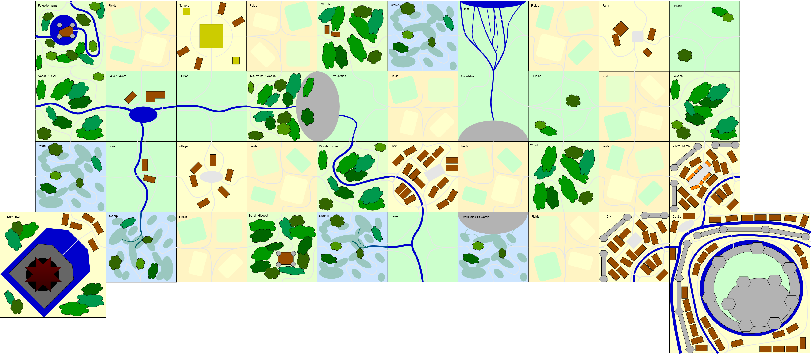

# World

The game world is made up of a number of *sections*.

For example:

## Sections

Each section has a *type*. This may be a single type, or a combined type.

The character's [species](Characters.md#species) or [class](Characters.md#classes) 
may have special abilities or stat modifications based on the terrain type of 
the section they are at. 

Section types also influence the possible [adventures](Adventures.md) that may 
be encountered.

## Base Types

Each terrain has a base type, which may or may not be expanded upon by a 
[combinable type](#combinable-types).
The following base types are available:

### Community

The long-term habitation has transformed this section into its own base type.

Map rules:
- Cannot be bordering another community, unless part of a larger one.

### Field

Fields provide communities with the food they require for their daily meals.

Map rules:
- Not in the drawable set, added only as consequence of community efforts.

### Plains

Open grassy spaces with sometimes a tree or a shepherd with their flock.

Map rules:
- None

### Hills

Not as tall or steep as mountains, these landfills can be full of dangers.

Map rules:
- None

### Woods

Luckily there's open spaces, the dark trees and foliage seem barely traversable.

Map rules:
- None

### Swamp

Watch your step... in this swampy section you can't be sure about anything.

Map rules:
- Must be next to a [river](#river) type section.

## Combinable Types

Combinable types apply on top of a [base type](#base-types). 

### River

There's a river flowing through this section. Let's hope there's a crossing...

Map rules:
- Must be placed connecting to more river.

### Mountain

Often the source of rivers, mountains are tall obstacles full of dangers.

Map rules:
- When the source of a river, must be connected to more [river](#river).

### Delta

The river is turning into a delta with smaller streams that flow into the sea. 

Map rules:
- Must be placed connecting to a [river](#river).
- Must be placed at a map edge, facing outwards.

### Lake

A lake has formed here... What a seemingly idyllic area!

Map rules:
- Combines with a [river](#river) type.
- Combines with a [field](#field) type.

## Special Types

Unless specified otherwise, these are based on [community](#community) types.

### Farm

A tiny community of farmers and their livestock.

Map rules:
- Gets 2 fields.

### Village

A small community with hard-working labourers.

Map rules:
- Gets 2 fields.

### Town

A medium-sized community with industrious townsfolk.

Map rules:
- Gets 2 fields.

### City section

Part of a larger community full of people.

Map rules:
- Gets 1 field.
- Connects with the castle.

### City market

Part of a larger community with a market.

Map rules:
- Gets 1 field.
- Connects with the castle.

### Castle

The heavily fortified seat of the duke that governs this province.

Map rules:
- Connects with city sections.
- Always placed in the southeast corner.

### Temple

Sacred place of worship to the gods.

Map rules:
- Gets 2 fields.
- Unless it is the starting location, there must be at least 5 sections between 
  this and the starting location.

### Tavern

Drinks, warm meals, a bed... All a weary traveler might wish for.

Map rules:
- Combines with a [lake](#lake) type.
- Unless it is the starting location, there must be at least 5 sections between
  this and the starting location.

### Lumberjack Cabin

Small cabins in the woods, with lumberjacks.

Map rules:
- Combines with a [woods](#woods) type.

### Forgotten Ruins

Once a proud outpost of the kingdom, now turned into ruins. 

Map rules:
- Combines with a [woods](#woods) type.
- Combines with a [river](#river) type.

### Bandit Hideout

Barely visible through the thick foliage stands a camouflaged outpost.

Map rules:
- Combines with a [woods](#woods) type.

### Dark Tower

The fearsome outpost of the neighbouring kingdom.

Map rules:
- Always placed in a corner on the western side of the map.
