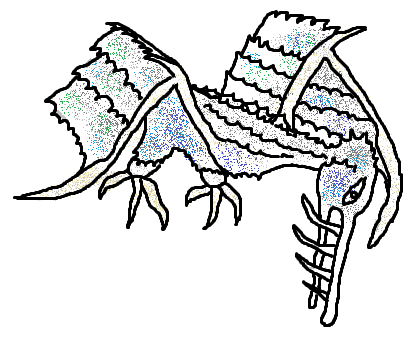

# Paper Pop-up Board Game RPG

How's that for a working title?

## Basics

### Paper Pop-up

A board game with animated 3D graphics? Say what? Yep.

For a tiny demo / sneak preview of the kinds of mechanisms involved, see:

### Board Game RPG

The game is set in a world that allows for a myriad of different storylines, 
themes, main goals and side quests.

## Goals

### As a game

A video-game-like board game with three-dimensional graphics, and a compelling 
storyline that's different in each match. 

Maps, stories and enemies are randomly "generated" through dice and card stacks. 
Graphics are made out of paper, animated by popping up when opening the cards 
and through pull-strips and occasional turning wheels.

For the ultimate experience, the very opening of the box that contains the game 
triggers a detailed popup that sets the mood and presents a "Stratadox Presents" 
banner.

> I want full immersion. They have to be **in** there. They influence the game, 
> the game influences them. They get to party if they win... When their 
> characters die, they cry. 

### As a player

Players ultimately strive for a place on their local [leaderboard](Leaderboard.md). 
There are two separate high-score tables a player can aim for: the individual 
score, per character, and the team score.

The players work together as a team to fulfil their quest. Quests are randomly 
assigned based on the [storyline](Cards/Story.md) that applies to the match. 
Without fulfilling the main quest, players stand little chance of making it to 
either board.

## Gameplay

By drawing cards, throwing dice and making tactical and strategic decisions, the 
characters explore the game world to fulfil their main- and side quests.

The players start by picking a character and drawing the first chapter of the 
story. For more details, see the [gameplay section](Gameplay.md).

## World

The game is set in a magical medieval-style world, in order to make it more 
original. After all, nobody else has ever put their fantasy game in a medieval 
setting yet. 😅

Are medieval magic fantasy tropes overused? Possibly. This is my game, if I 
want to make a medieval fantasy game, then that's what I'll make! 😁 
Besides, with all the original content that's built on top of it, having a 
familiar world style might just be the anchor needed to keep it understandable
and immersive.

The [playable characters](Cards/Characters.md#species) are all "existing" 
species in fantasy, some more common (human, elf, dwarf) than others (goblin, 
centaur, reptilian) but each of them will already have some familiarity to most 
players.

Most [enemies](Cards/Enemies.md#enemy-types) are custom-made for this game. 
Each kind of enemy has their own backstory, fitting in the context of the 
[background](Background.md) of the game world. While, for instance, the 
[leleblum](Cards/Enemies.md#leleblum) are an imported slave warrior species, 
the [torturans](Cards/Enemies.md#torturan) and [bergebub](Cards/Enemies.md#bergebub) 
are very much native to these lands.

Although the characters don't realize it, the world where the game takes place 
is a tiny border planet that plays a minor role in a [greater intergalactic 
conflict](Gods.md). Does that knowledge help us defeat these [gargantuma 
birds](Cards/Enemies.md#gargantuma) that have their minds set on eating us? 
Probably not, but it's there if you're interested.

### Concept art

#### Leleblum

#### Torturan

#### Bergebub

#### Gargantuma

### Map

A map of the world might look somewhat like this:

